## GAN MNIST Implementation `main_gan.py`

The model consists of a fully connected generator and discriminator modules. The MNIST images are flattened before presenting to the discriminator that outputs a probability score for real and fake. The output of the generator is a flattened vector (same dimensions as original images) on which tanh function is performed, as the original image is normalized on the scale of −1 to 1. 

| 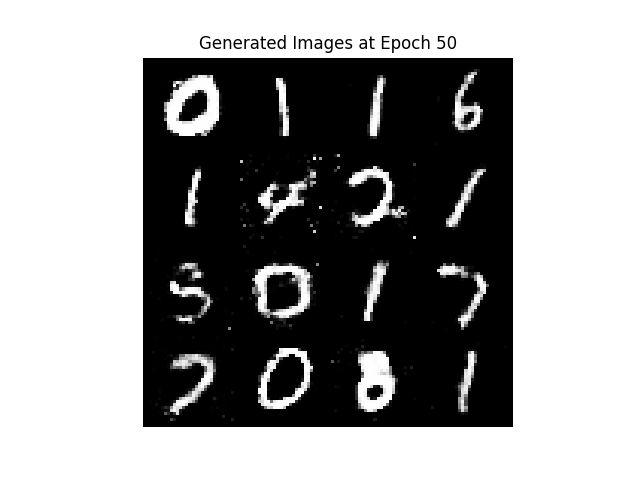 | 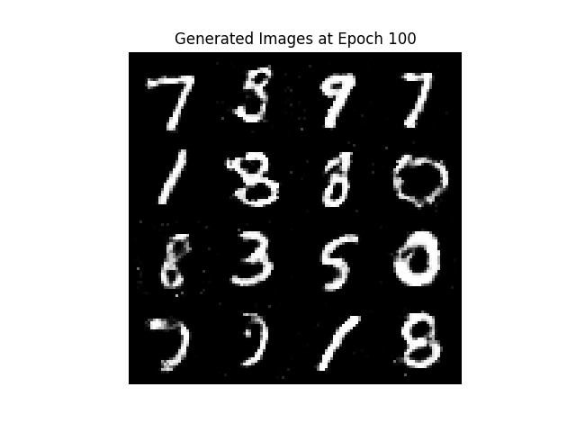 |
|----------------------------------------------------|----------------------------------------------------|
| 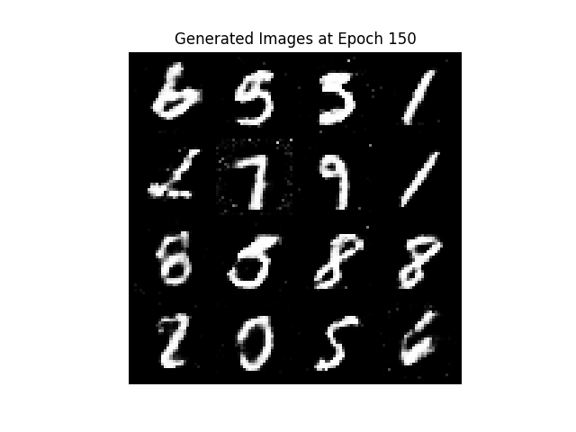 | 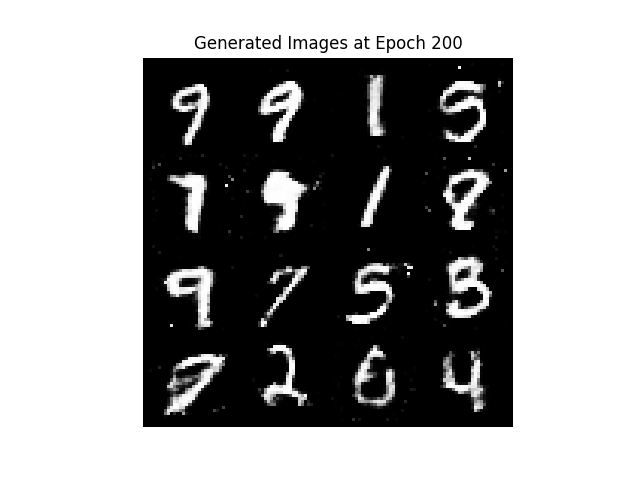 |


Make the following modifications under `main_gan.py`, if required. 

### MNIST GAN Model Hyperparameters

```python
mnist_model_kwargs = {
    "latent_variable_size": 64, #(change, if required)
    "discriminator_hidden_size": 256, #(change, if required)
    "generator_hidden_size": 256, #(change, if required)
    "image_size": 784,  # 28x28 --> flatten (Fixed)
}

```

### Dataset Parameters

```python
dataset_kwargs = {
    "dataset_type":"mnist",
    "batch_size":16, #(change, if required)
    "shuffle":True #(change, if required)
}
``` 

### Trainer Hyperparameters
```python
trainer_kwargs = {
    "num_epochs":200, #(change, if required)
    "generator_lr":0.0002, 
    "discriminator_lr":0.0002, 
    "output_dir":"mnist_GAN" #(change, if required)        
}
``` 
## GAN CIFAR10 Implementation `main_dcgan.py`

The model consists convolutional layers which helps preserve the spatial dimension. The discriminator performs downscaling operation by performing a series of 4x4 of stride 2. The generator on the other hand performs upscaling operation on a latent vector using convolutional-transpose operation. The output of the generator is tanh activated as and of the same size as the original image.

| 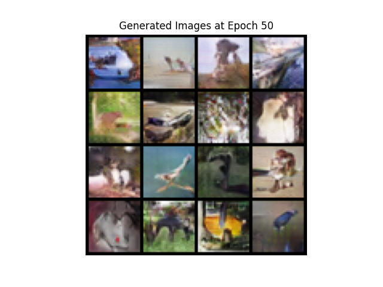 | 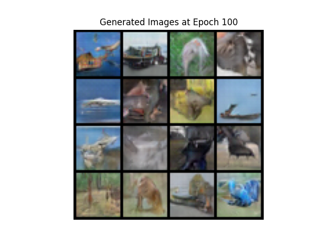 |
|----------------------------------------------------|----------------------------------------------------|
| 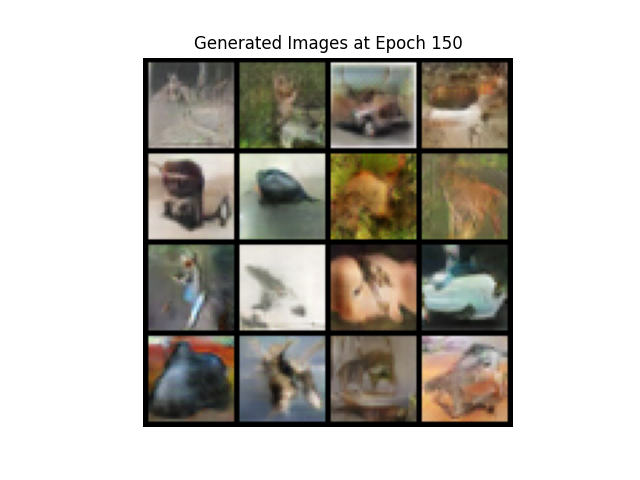 | 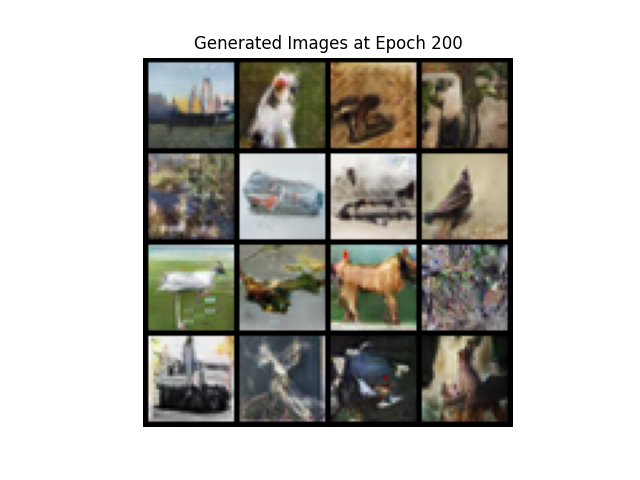 |


Make the following modifications under `main_dcgan.py`, if required.

### CIFAR10 GAN Model Hyperparameters

```python
    model_kwargs = {
        "latent_dim": 100,
        "feature_maps": 64,
        "image_channels": 3
    }

```

### Dataset Parameters

```python
dataset_kwargs = {
    "dataset_type":"cifar10",
    "batch_size":16, 
    "shuffle":True
}  
``` 

### Trainer Hyperparameters
```python
trainer_kwargs = {
    "num_epochs":200,
    "generator_lr":0.0002,
    "discriminator_lr":0.0002, 
    "output_dir":"cifar10_GAN"
    
}  
``` 

| 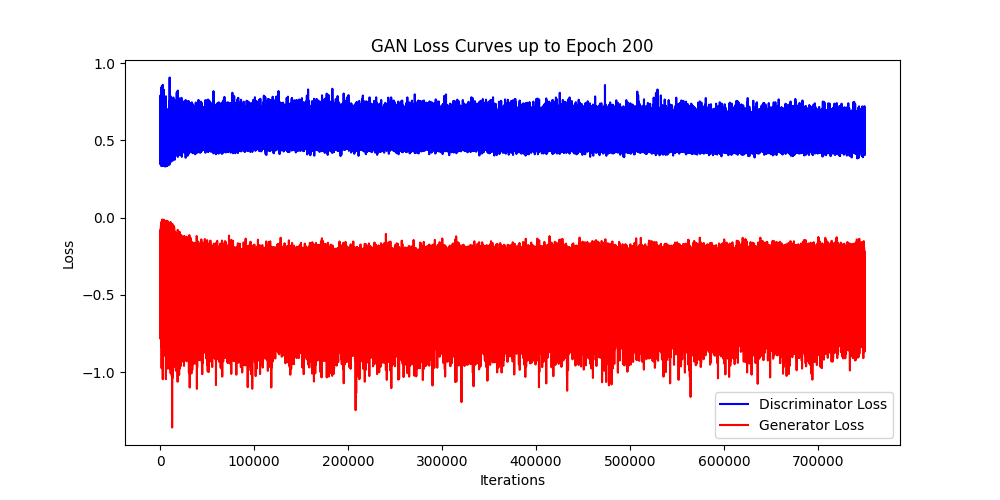 | 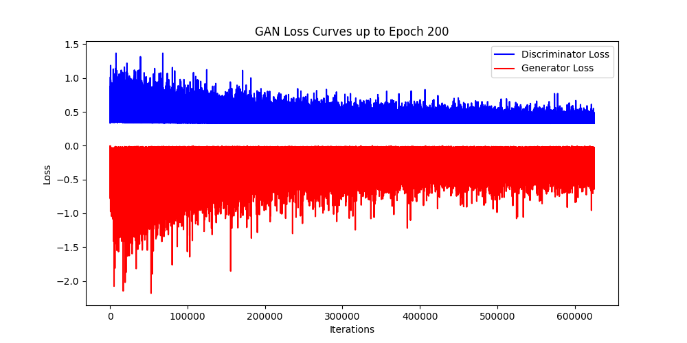 |
|:-------------------------------------------------:|:-------------------------------------------------:|
| **MNIST GAN Loss Curve after 200 epochs**                    | **CIFAR10 GAN Loss Curve after 200 epochs**                   |

| 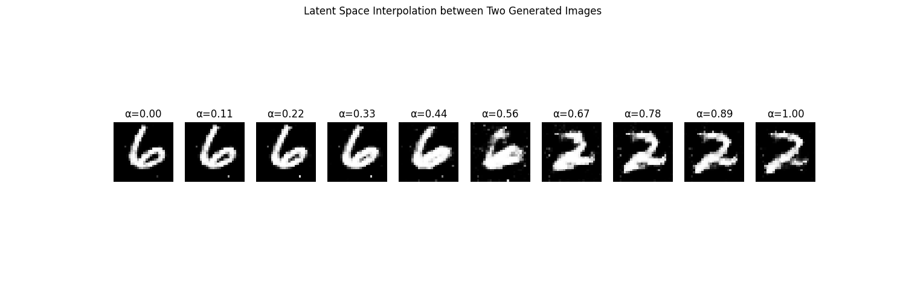 | 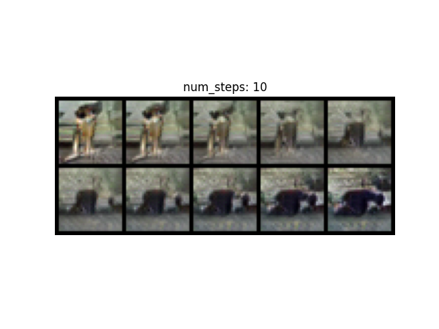 |
|:-------------------------------------------------:|:-------------------------------------------------:|
| **Latent Space Interpolation MNIST**                   | **Latent Space Interpolation CIFAR10**                    |

Execute `latent_space_interpolation.py` to perform latent space interpolation for GANs (both MNIST and CIFAR10). 

```python
weights_path = "" # point to the respective directory and .pt file. 
output_dir = "" # point to the output directory where the result is stored. 
```

## VAE MNIST Implementation `main_vae.py`

The variational autoencoder module consists of a Fully-Connected Encoder that outputs the μ and σ of the latent space distribution. The decoder consumes the latent vector, to perform linear combinations (using Fully-Connected) to output the flattened vector of the MNIST image. The model is trained on a sum loss of reconstruction loss and KL Divergence. 

```python

    mnist_model_kwargs = { 
        "hidden_size":1024, #(change, if required)
        "latent_dim":512, #(change, if required)
        "image_size":784, #28x28 --> flatten
    }    
    
    dataset_kwargs = {
        "dataset_type":"mnist",
        "batch_size":16, #(change, if required)
        "shuffle":True, #(change, if required)
        "normalize":False 
    }    
    
    trainer_kwargs = {
        "num_epochs":50, #(change, if required)
        "lr":1e-3, #(change, if required)
        "output_dir":"mnist_VAE" #(change, if required)
        
    }  

```

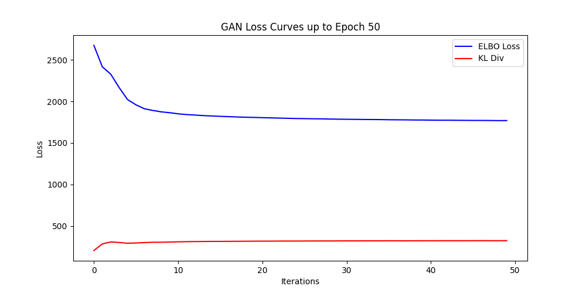

| 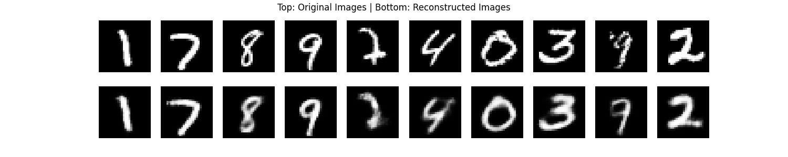 | 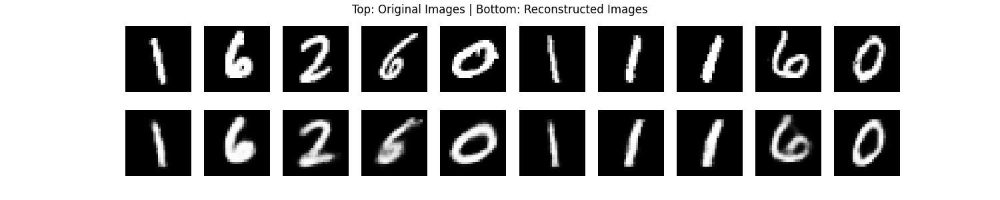 | 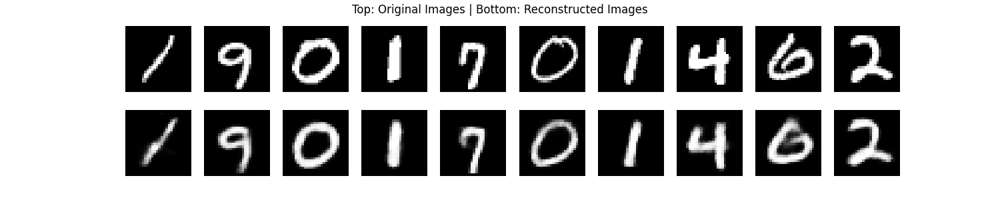 |
|:-------------------------------:|:-------------------------------:|:-------------------------------:|
| 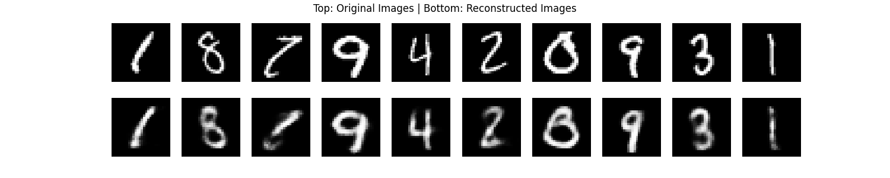  | 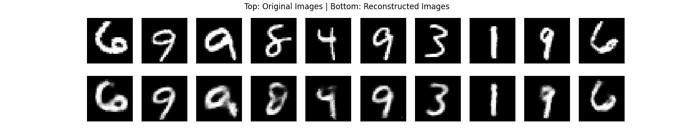 |                                 |


### Reconstruction Error Distribution for Anamoly Detection `detect_vae_anamolies.py`

Anomaly Detection is achieved by by measuring how well a model reconstructs input data. The reconstruction error for both normal (clean) and anomalous (corrupted) images is computed using a loss function, such as Binary Cross-Entropy Loss (BCELoss). The clean images represent typical data
from the dataset, while the corrupted images are intentionally perturbed by adding noise. 

```python
weights_path = "" # point to the respective directory and .pt file. 
output_dir = "" # point to the output directory where the result is stored. 
```

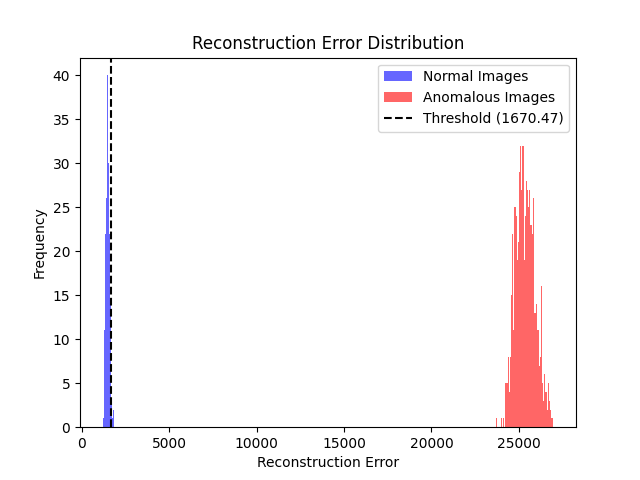

### Latent Space 2D `latent_space_vae.py` 

This script performs a two-dimensional visualization of the latent space in a Variational Autoencoder (VAE) trained on the MNIST dataset. It loads a pre-trained VAE model, passes test images through the encoder, and retrieves the mean latent vectors (mu) for each sample, which represent the learned compressed features. 

To visualize these high-dimensional latent vectors, the script uses Principal Component Analysis (PCA) to reduce the dimensionality to 2D. After the transformation, it generates a scatter plot of the latent representations, with each point color-coded according to its original digit class label. This visualization highlights how well the VAE clusters distinct classes in its latent space. 

```python
weights_path = "" # point to the respective directory and .pt file. 
output_dir = "" # point to the output directory where the result is stored. 
```

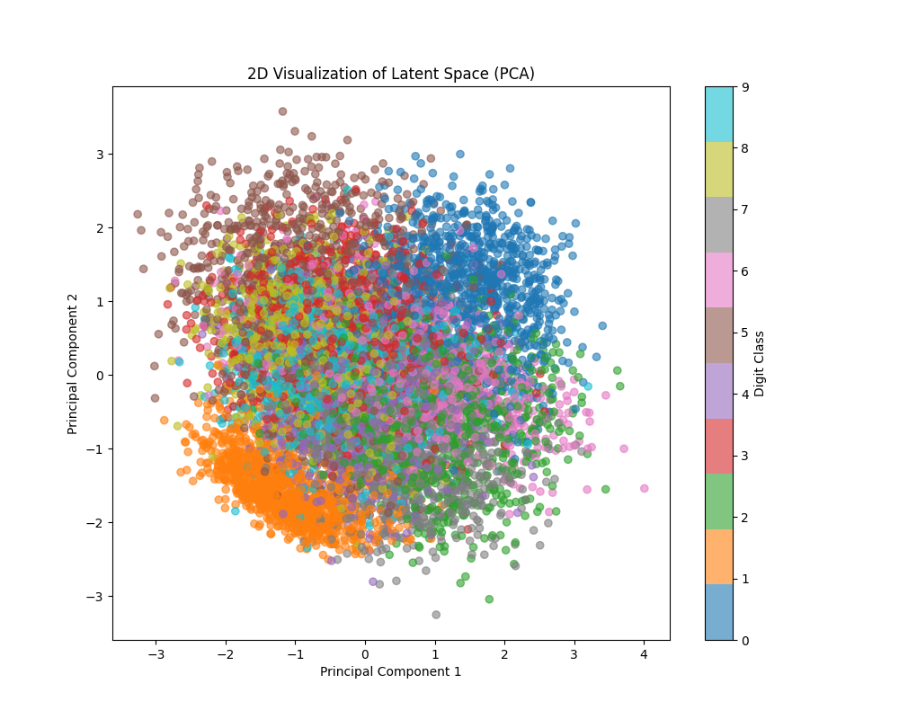